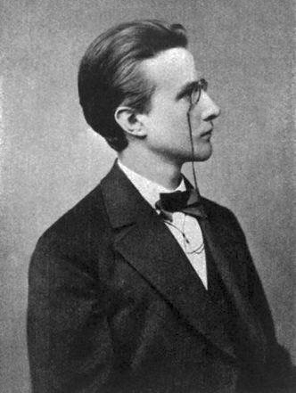
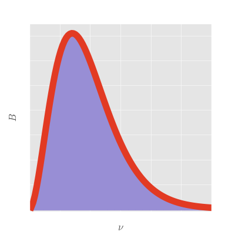

Title: Ultriviolet catastrophe and the beginning of quantum mechanics
Summary: 

We just finished a very long explication of the fundamentals of dimensional
analysis and the Buckingham Pi theorem 
(well, not "just", since it took me significantly longer 
than I anticipated to finish up this post).
That could be the end of this series, but it would be a shame to end it without showing at least one
example of some of the cool analysis that can be done in a more complicated
system than the ones we have considered so far.

The example that we will be considering is the problem of the "ultraviolet
catastrophe", a famous problem which demonstrated in the late nineteenth
and early twentieth century that not all was well with classical physics.
It also has the distinction of having one of the coolest names for an 
unsolved problem in science. For a long time sedimentary geology had 
an unsolved problem about the origin of the mineral dolomite, known as
the "dolomite problem". Doesn't quite have the same ring to it.

## Spectral radiance

At its heart, the ultraviolet catastrophe has to do with the question of how
hot objects cool off (as somebody who studies convection and the thermal
evolution of planets, I am biased towards thinking that a great many problems in 
science boil down to a question of how hot things cool off).
Nineteenth century scientists observed that objects at high temperatures
would radiate electromagnetic waves to space around them in a process known as radiative cooling.
We are all quite familiar with the effects of radiative cooling, even if we
do not recognize it: the sun is an immensely hot ball of matter, and that heat is
radiated to space as electromagnetic waves, which we percieve as as the
warmth and brightness of a sunny day.

Scientists further observed that hot bodies such as the sun did 
not radiate light at a single frequency but rather as a spectrum:

 vs radiance of the sun. (image from Global Warming Art)")

Furthermore, the shape of that spectrum and its peak
frequency seemed to be a function of the body's temperature. 
At lower temperatures, the object would give off predominantly 
lower frequency radiation and at higher temperatures it would give off
predominantly higher frequency radiation.

Most objects that we interact with on a daily basis are at too low of 
temperatures to radiate in the visible spectrum, but you have probably
seen a hot poker glow red, which means it is certainly too hot to touch.
If it gets a lot hotter than that, it may start to glow white, reflecting
the presence of higher frequency radiation.

The question of the radiative spectrum that a body emits is not just of 
theoretical interest: it is intensely practical in many areas of science
and engineering. After all, if we could understand what determines the 
spectrum of a radiating body, we can measure its temperature without
needing to touch it, nor do we even need to be particularly close to it.
We just need to be able to see it. This would allow us to know the temperature
of stars and planets, as well as measure the temperature of many otherwise
difficult to access laboratory experiments.

Indeed, let's frame the question of spectral radiance in terms of our
initial example: the sun. We would like to be able to look at the spectrum
of the light given off by the sun and answer two fundamental questions:

1. How hot is the sun?
2. How much energy does the sun radiate to space?

")

Okay, so with that prelude, let's take a crack at the dimensional analysis of this problem.
The observation that we are trying to explain is the radiation of 
energy from the surface of an object. That is to say, for a given frequency the object
gives off a certain amount of energy per unit surface area per unit time, or
\begin{equation}
[B] = \frac{\text{energy}}{\text{frequency} \cdot \text{area} \cdot \text{time} }
\end{equation}
This quantity $B$ is known as the spectral radiance.
Expressed in terms of SI units it becomes
\begin{equation}
[B] = \frac{\mathrm{kg}}{\mathrm{s}^2}
\label{units_spectral_radiance}
\end{equation}
The picky may note that the conventional dimensions of this quantity also
include the units of the solid angle over which this energy is measured.
This solid angle is dimensionless (steradians), so does not affect the 
analysis here. If you like, you can pretend I have integrated over some
solid angle and am carrying around an additional parameter indicating that
angle. It is otherwise unimportant here.

## Dimensional accounting

We now need to list the parameters that are important for this problem.
We already know several based upon the observations. First, we know that the frequency
of the radiation $\nu$ plays a role. Second, we know that the temperature $T$
of the body in question must matter, since the temperature dependence of the spectrum
is one of our fundamental observations. And if temperature is important, Boltzmann's
constant $k_B$ cannot be far behind, since that is statistical mechanics'
bridge between temperature and energy. Finally, we are talking about heat
transfer by the propagation of electromagnetic waves through space before
they reach our instruments (or eyes). Therefore the speed of light $c$ is
probably important to this problem. 

You may be tempted to include the wavelength of the light as an additional parameter.
However, the wavelength is related to the frequency and the speed of light through
the equation $\lambda = c/\nu$, and as such should not be regarded as an independent parameter.

The above parameters have units

\begin{equation}
\begin{aligned}
\left[ \nu \right] &= \frac{1}{\mathrm{s}} \\
[T] &= \mathrm{K} \\
[k_B] &= \frac{\mathrm{kg} \; \mathrm{m}^2}{\mathrm{s}^2 \; \mathrm{K}} \\
[c] &= \frac{\mathrm{m}}{\mathrm{s}}
\end{aligned}
\label{parameters}
\end{equation}

Is that enough? Well, let's apply the Buckingham Pi theorem: the number
of fundamental units $k$ is four: $\mathrm{kg}$, $\mathrm{K}$, $\mathrm{m}$, and $\mathrm{s}$.
The number of parameters $n$ is also four. Therefore, the number of nondimensional
numbers $n-k$ in this problem is zero, meaning there is only one way to combine
the parameters in a way to get the units of equation \eqref{units_spectral_radiance}.

The ambitious reader can try themselves, either by hand or by using the 
[buckinghampy software](https://github.com/ian-r-rose/buckinghampy)
[developed previously](automated-dimensional-analysis.html).
Otherwise, here is the one way to get the dimensions of spectral radiance:

\begin{equation}
B \sim \frac{k_B T \nu^2}{c^2}
\label{rayleigh-jeans}
\end{equation}

Up to a factor of two, this equation is known as the 
[Rayleigh-Jeans](https://en.wikipedia.org/wiki/Rayleigh%E2%80%93Jeans_law) law. 
It was developed to explain the spectrum of radiating bodies, and, at least for
lower temperatures, it did a pretty good job. All we need to do is fit our observed
spectrum to the Rayleigh-Jeans law to determine the temperatures.
So we could pat ourselves on the back. Another dimensional analysis job well done.

## The Ultraviolet Catastrophe

When we try to use the Rayleigh-Jeans law to fit a spectrum that looks
like that of the sun (shown above), we might start to get a little nervous.
After all, the Rayleigh-Jeans law is quadratic in the frequency, which
should make a parabola on a frequency-radiance plot. The solar spectrum
certainly does not look like a parabola.

Things start to really go sideways when we try to answer our second question
about the sun: how much energy is it radiating to space?
After all, we are not only interested in its temperature, but also its
ability to heat other planets, and its thermal evolution over the history of the solar system.
Well, we have an expression that gives the energy radiated as a function of frequency. 
As far as we know, no frequencies of light are special: all are equally possible.
We can go to arbitrarily high frequencies by inserting more wiggles
(for more on this, read about the [equipartition theorem](https://en.wikipedia.org/wiki/Equipartition_theorem)).

So we should be able to get the total energy per unit area per time radiating from the 
body by integrating over all the possible frequencies. That is to say,
we need to integrate equation \eqref{rayleigh-jeans} with respect to frequency from zero to infinity:

\begin{equation}
E \sim \int_0^\infty \frac{k_B T \nu^2}{c^2} d\nu
\label{integrated_rayleigh_jeans}
\end{equation}

Here is a plot of that integral:

Uh oh. There is a problem. There is no way that this integral can possibly converge
on a finite answer, since the $\nu^2$ factor must blow up as we integrate to infinity.
We are therefore led to the conclusion that a body which is radiating to space
has to radiate an infinite amount of energy per unit time. This cannot possibly be true,
otherwise we would have been building power plants around all manner of trash to
harness some of that power. This result, which was due to a fundamental flaw in 
classical physics, is the famous "ultraviolet catastrophe." It is so named due
to the catastrophic blowing up of the radiated energy at the higher, ultraviolet frequencies.

## Quantization

From a dimensional standpoint, the ultraviolet catastrophe is pretty inevitable.
There is no way to prevent equation \eqref{integrated_rayleigh_jeans} from 
blowing up at high frequencies since this is the only form of the equation
for spectral radiance allowable. The only way out is to introduce some
extra physics, which will, in turn, enrich the parameter space and provide us an out.

Enter [Max Planck](https://en.wikipedia.org/wiki/Max_Planck).

Planck was a German physicist working on on this problem around the turn of the twentieth century. 
In an effort to better match the observations, 
he made the assumption that the radiated energy could only be emitted in discrete
packets of energy (called "quanta," whence the term "quantum mechanics").
These quanta were related to the frequency of the radiation via a constant $h$:

\begin{equation}
E_{\mathrm{quanta}} = h \nu
\end{equation}

The ramifications of this assumption were enormous
(many of which made Planck, and later Einstein, uncomfortable). 
These consequences, however, are well outside of the scope of this article.
For our purposes, this new parameter $h$ will have some pretty significant consequences
for our dimensional analysis.

## A new dimensional accounting

Max Planck's new constant, which now bears his name, has the units

\begin{equation}
[h] = \frac{ \mathrm{kg} \; \mathrm{m}^2 }{\mathrm{s}}
\end{equation}

If you have been following this series so far, the significance of having a new parameter
should be clear: we have now increased the dimension of the nullspace, allowing for one
(and only one) nondimensional number to enter the problem.

A bit of rearranging the parameters is enough to figure out what that number must be
(I encourage the reader to work it out for themselves):

\begin{equation}
\xi = \frac{h \nu}{k_B T}
\label{nondim}
\end{equation}

We now have a new degree of freedom when it comes to representing the units
of the spectral radiance, allowing us to write down its general form:

\begin{equation}
B \sim \frac{h \nu^3}{c^2} f(\xi)
\end{equation}

Notice that if $f(\xi) = 1/\xi$ then we can recover the Rayleigh-Jeans law.
However, dimensionally speaking, $f(\xi)$ can be anything.
As before, we can ask the question of what the total energy radiating
from the sun is. The analogue to equation \eqref{integrated_rayleigh_jeans} is

\begin{equation}
E \sim \int_0^\infty \frac{h \nu^3}{c^2} f(\xi) d\nu
\label{almost_stefan_boltzmann}
\end{equation}

Unlike equation \eqref{integrated_rayleigh_jeans}, this actually
has a chance of converging. As long as $f(\xi)$ goes to zero
fast enough as $\nu^3$ goes to infinity, the total amount of energy
will remain bounded. Do we have any guarantees that $f(\xi)$ will do that?
Unfortunately not. This is just about as far as dimensional analysis can take us.

To go further, we would need to bring in some physics, which Max Planck has
helpfully done by working out the functional form of $f(\xi)$:

\begin{equation}
f(\xi) = \frac{1}{e^{\xi} - 1}
\end{equation}

This does indeed converge when you perform the integration in equation \eqref{almost_stefan_boltzmann}
(though I do not evaluate the integral here).

Here is the plot of what is now known as Planck's law, relating frequency to spectral radiance.
As you can see, the shape of the curve looks much more like that of the observed solar spectrum
and the area underneath the curve does not blow up:

We can now safely fit the solar spectrum to Planck's law to determine the temperature
of the sun, all without actually going there. And though we used the sun as our primary
example, this works for basically anything: using Planck's law we know to pretty high
accuracy the temperature of most visible astronomical objects.

## The Stefan-Boltzmann law

Okay, it wasn't strictly true that this was as far as dimensional analysis can take us.
There is one more trick we can do to interrogate the integral in equation \eqref{almost_stefan_boltzmann}.
A variable substitution will allow us to perform the integral over $\xi$ instead of $\nu$.
Rearranging equation \eqref{nondim} gives us
\begin{equation}
\nu = \frac{\xi k_B T}{h}
\end{equation}
and
\begin{equation}
d\nu = \frac{k_B T}{h} d\xi
\end{equation}

Substituting these into equation \eqref{almost_stefan_boltzmann} gives us

\begin{equation}
E \sim \int_0^\infty \frac{\xi^3 k_B^4 T^4}{h^3 c^2} f(\xi) d\xi
\end{equation}

The parameters $k_B$, $T$, $h$, and $c$ do not depend on the frequency,
so we can pull them outside of the integral:

\begin{equation}
E \sim \frac{k_B^4 T^4}{h^3 c^2} \int_0^\infty \xi^3 f(\xi) d\xi
\end{equation}

Something kind of remarkable has just happened with this substitution:
the integral is a now a definite integral over a nondimensional function.
In other words, as long as the integrand converges,
the integral is just a number, nothing more.
So let's give that number a name, even if we do not know its value:

\begin{equation}
\gamma = \int_0^\infty \xi^3 f(\xi) d\xi
\end{equation}

The equation for the total energy then becomes

\begin{equation}
E \sim \frac{ \gamma k_B^4 T^4}{h^3 c^2}
\label{stefan_boltzmann}
\end{equation}

This equation, up to a constant which we can easily fold into $\gamma$,
has a name: the [Stefan-Boltzmann law](https://en.wikipedia.org/wiki/Stefan%E2%80%93Boltzmann_law).
It tells us how much energy a radiating body gives off per unit time per unit area,
as a function of temperature.
In particular, it tells us that the energy radiated by a body is a *very* strong
function of temperature: $T$ is raised to the fourth power, which becomes huge at higher temperatures.

The Stefan-Boltzmann law finds many applications (for instance, in planetary science, it plays
a central role in calculating the greenhouse effect of an atmosphere),
and we were able to deduce it on on dimensional grounds (with an assist from Max Planck).

## Wrapping up

This is the end of my multi-part series of articles on dimensional analysis.
We [began](introduction-to-dimensional-analysis.html) by describing the fundamental question that dimensional analysis asks.
We followed that up by giving a [qualitative explanation](nondimensional-numbers-and-the-buckingham-pi-theorem.html)
of the theorem that answers that question: the Buckingham Pi theorem.
Then we gave an [informal proof](linear-algebra-and-the-buckingham-pi-theorem.html) of the theorem. 
The proof wound up relying on some pretty standard results from linear algebra
(which computers are very good at doing), and so we 
[wrote](automated-dimensional-analysis.html) a
[small Python package](https://github.com/ian-r-rose/buckinghampy)
that applies the Buckingham Pi theorem to an arbitrary set of parameters.
Finally, in this article we investigated a problem of some historical importance
through the lens of dimensional analysis (and I think it worked reasonably well).

A lot of the ideas in this series were drawn from the excellent treatises of
Percy Bridgman and G.I. Barenblatt on the topic of dimensional analysis, as
well as from the inimitable Wikipedia.
Any errors or omissions are my own.
